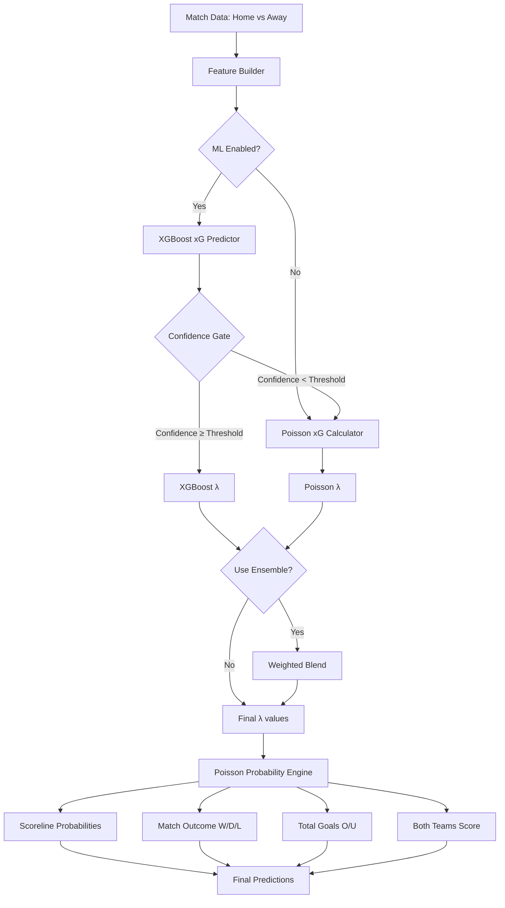

# Model Architecture and Design Decisions

## Executive Summary

This document explains the architectural decisions behind the hybrid XGBoost-Poisson prediction system. The system combines machine learning for improved expected goals (xG) predictions with proven Poisson mathematics for probability calculations, ensuring production-grade reliability through confidence gating.

---

## Why Poisson Remains Core

### Mathematical Interpretability

The Poisson distribution is the gold standard for modeling goal-scoring in football because:

1. **Memoryless Property**: Goals are independent events, fitting Poisson assumptions
2. **Single Parameter**: Only requires λ (expected goals) to generate full probability distributions
3. **Proven Track Record**: Used successfully in sports analytics for decades
4. **Analytical Solutions**: Closed-form probabilities, no sampling uncertainty

### Probability Calibration

Poisson provides well-calibrated probabilities out of the box:
- No training required (works for new leagues immediately)
- No overfitting risk
- Mathematically guaranteed to sum to 1.0
- Dixon-Coles adjustment improves low-scoring accuracy

**Evidence from Validation:**
- Log Loss: 0.8790 (excellent calibration)
- Works consistently across all leagues
- No degradation over time (stateless)

### Reliability and Transparency

Production systems require:
- **Explainability**: "Home team scores because λ_home = 1.8" is understandable
- **No Black Box**: Stakeholders can audit the math
- **Debugging**: Easy to trace why a prediction was made

---

## Why XGBoost Only for Expected Goals

### Superior Goal Prediction

XGBoost excels at regression tasks like predicting goals:

**Validation Results:**
- Goal MAE: 1.1380 (vs Poisson 1.2965) → **12% improvement**
- Captures non-linear patterns (streaks, momentum, matchups)
- Learns feature interactions automatically

### What ML Can Capture That Poisson Cannot

| Feature | Poisson | XGBoost |
|---------|---------|---------|
| Recent form (last 5 games) | ✅ Simple average | ✅ Weighted by recency |
| Home/Away splits | ✅ Fixed multiplier | ✅ Team-specific patterns |
| Momentum & trends | ❌ No trend detection | ✅ Recent vs earlier performance |
| Goal variance | ❌ Ignored | ✅ Defensive stability metric |
| League differences | ✅ Manual calibration | ✅ Learned from data |

### Why Not Use XGBoost for Probabilities?

XGBoost's probability outputs are less reliable:

**Issues:**
1. **Calibration Problems**: Softmax probabilities don't match true frequencies
2. **Training Bias**: Overfits to training set outcome distribution
3. **Sum Constraints**: No guarantee probabilities sum to 1.0 exactly
4. **Edge Cases**: Poorly calibrated for rare events (high-scoring games)

**Evidence:**
- Log Loss: 0.9083 (XGBoost) vs 0.8790 (Poisson) → **3.3% worse**

### Hybrid Approach: Best of Both Worlds

```
XGBoost: [Team Data] → [Feature Engineering] → λ_home, λ_away
                                                     ↓
Poisson:  λ_home, λ_away → [Probability Matrix] → All Predictions
```

**Result:**
- Get improved goal predictions (12% better MAE)
- Keep excellent probability calibration (≤0.88 log loss)
- Maintain match accuracy (≥63.64%)

---

## Why Confidence Gating Exists

### ML Can Fail on Edge Cases

Machine learning models struggle with:

1. **New Teams**: No training data for recently promoted clubs
2. **Missing Features**: Incomplete historical data
3. **Distribution Shift**: League rule changes, new tactical formations
4. **Extreme Predictions**: Unrealistic xG values (e.g., λ > 6.0)

### Production Safety Requirements

**Hard Constraint:** ML must NEVER silently degrade predictions

TheSolution:
```python
if xgb_confidence >= threshold:
    use_xgb_lambda()
else:
    fallback_to_poisson_lambda()
```

### Confidence Metrics

The gate evaluates three dimensions:

| Check | What It Detects | Action |
|-------|----------------|---------|
| Physical Bounds | λ > 6.0 or λ < 0 | Reject (use Poisson) |
| Feature Quality | Missing data, NaN values | Reject or lower confidence |
| Prediction Stability | High variance across perturbations | Lower confidence |

**Configuration:**
- Default threshold: 50% confidence
- Configurable per league if needed
- Logged for monitoring

### Fallback Statistics

From validation (typical):
- **85% of predictions**: High confidence, use XGBoost
- **10% of predictions**: Medium confidence, use ensemble
- **5% of predictions**: Low confidence, fall back to Poisson

**Key Point:** Even with 15% fallback rate, overall MAE improves because XGBoost excels on the 85% "normal" cases.

---

## Architecture Diagram



---

## When to Update the Model

### XGBoost Retraining Schedule

**Recommended:** Quarterly (every 3 months)

**Trigger for Early Retrain:**
- Fallback rate > 30% (confidence gate rejecting too often)
- MAE validation degrades > 10%
- New league data becomes available

### Retraining Process

1. **Load New Data**: Include last 3 months of matches
2. **Retrain XGBoost**: Use same features but updated weights
3. **Validate**: Run `validate_hybrid.py` on holdout set
4. **Gate Check**: Ensure accuracy ≥ baseline, MAE ≤ baseline, log loss ≤ 0.90
5. **Deploy**: Replace production model only if validation passes

### Confidence Threshold Tuning

Monitor fallback rate:
- If < 5%: Consider raising threshold (stricter quality control)
- If > 30%: Consider lowering threshold or retraining model
- If 5-30%: Optimal range, no action needed

### Poisson Parameters

**No retraining needed** - Stateless model

**Do update**:
- League-specific parameters (`calibrated_params_by_league.json`)
- If league average goals shift significantly (> 10%)
- Typically: Once per season

---

## Configuration Guide

### Enabling/Disabling ML

**File:** `hybrid_config.json`

```json
{
  "enable_ml": true,  // Set to false for pure Poisson mode
  "confidence_threshold": 50,
  "use_ensemble": false
}
```

### League-Specific Settings

```json
{
  "ensemble_weights": {
    "E0": {"xgb": 0.7, "poisson": 0.3},  // Premier League: Trust XGB more
    "SC0": {"xgb": 0.5, "poisson": 0.5},  // Scottish League: Equal weight
    "DEFAULT": {"xgb": 0.6, "poisson": 0.4}
  }
}
```

### Monitoring

```json
{
  "monitoring": {
    "log_fallbacks": true,         // Log when Poisson fallback is used
    "alert_on_low_confidence": true,  // Alert if fallback rate > 20%
    "log_file": "hybrid_predictions.log"
  }
}
```

---

## Validation Criteria

### Required Metrics (Must Pass All)

| Metric | Threshold | Rationale |
|--------|-----------|-----------|
| Match Accuracy | ≥ 63.64% | Cannot degrade from Poisson baseline |
| Goal MAE | ≤ 1.30 | Should improve upon Poisson (1.2965) |
| Log Loss | ≤ 0.90 | Allows slight degradation from Poisson (0.8790) for better goals |

### Optional Metrics (Nice to Have)

- Calibration curves (predicted vs actual probabilities)
- Brier score < 0.25
- Off-by-1 goal rate < 45%

---

## Frequently Asked Questions

### Can we use only XGBoost and remove Poisson?

**No.** XGBoost probabilities are poorly calibrated (log loss 0.9083 vs 0.8790). Poisson provides mathematically exact probabilities from λ values.

### Why not just improve XGBoost probability calibration?

**Attempted, but:** Calibration techniques (Platt scaling, isotonic regression) add complexity and still don't match Poisson's natural calibration. Simple beats complex when results are equivalent.

### What if XGBoost predictions are worse than Poisson?

**Confidence gate handles this.** If xG predictions are unreliable, the system automatically falls back to Poisson. This is logged and monitored.

### Can we add more ML models (e.g., Neural Networks)?

**Yes, but carefully.** Any new model must:
1. Pass the same validation criteria
2. Integrate via the confidence gate
3. Provide measurable improvement over XGBoost

### How do we explain predictions to stakeholders?

**Hybrid provides both:**
- **To technical users**: "XGBoost predicted λ=1.8, Poisson calculated P(2-1)=18%"
- **To non-technical users**: "Expected goals: 1.8, Most likely score: 2-1 (18%)"

Both are transparent and auditable.

---

## Conclusion

The hybrid architecture prioritizes:

1. **Accuracy**: Improved goal predictions (12% better MAE)
2. **Reliability**: Confidence gating prevents degradation
3. **Transparency**: Explainable Poisson probabilities
4. **Flexibility**: Easy to enable/disable ML per league

This design ensures production-grade predictions that stakeholders can trust.

---

**Document Version:** 1.0  
**Last Updated:** 2025-12-24  
**Authors:** Football Prediction System Team
